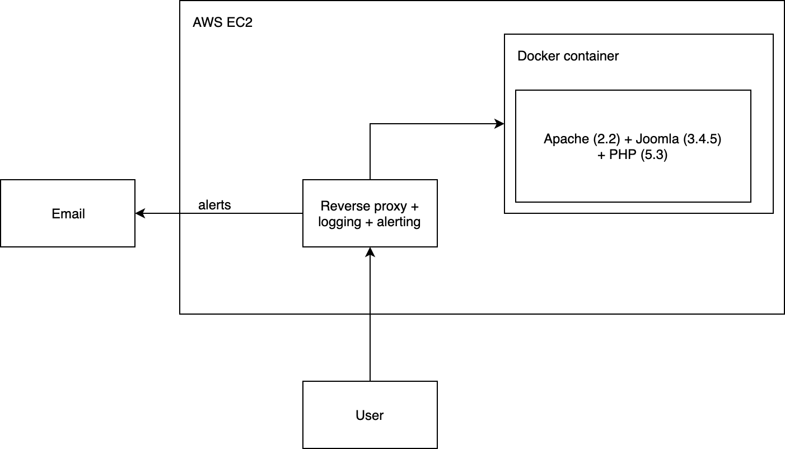

Project realizes honeypot functionality.

It exposes vulnerable joomla instance with custom reverse proxy to log all attacker activity.

CVE: [https://nvd.nist.gov/vuln/detail/CVE-2015-8562](https://nvd.nist.gov/vuln/detail/CVE-2015-8562)

### How to run proxy
`./runNodeProxy.sh`

### How to run joomla

Build docker image in `joomla-docker/`

`docker run -p 4444:80 -d <IMAGE_ID>`

### How to test
Use prepared exploit in `exploit.py`
